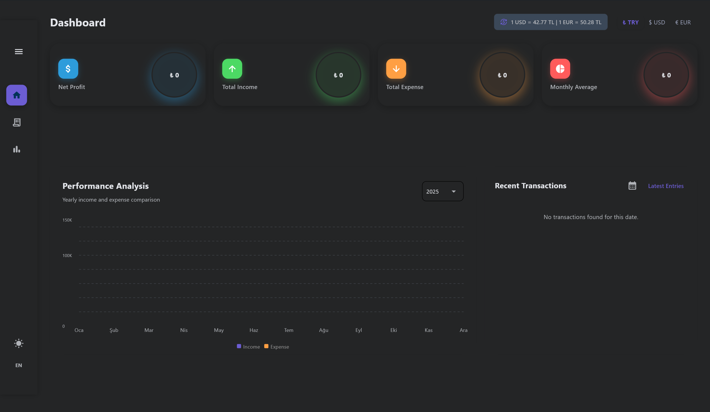
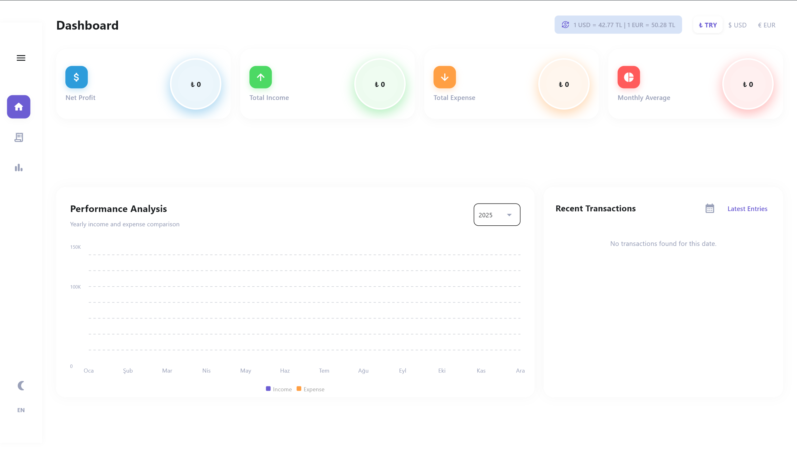

# Excellent: Advanced Invoice Management System


**Excellent** is a high-performance, modern desktop application designed to streamline financial tracking, invoice management, and tax calculations. It combines the ease of **Python (Flet)** for the UI with the speed and safety of **Rust** for backend operations.

<p align="center">
  
  &nbsp; &nbsp;
  
</p>

## 🚀 Key Features

* **📊 Smart Calculations:** Instantly calculate sales, purchases, profit/loss margins, and tax amounts.
* **⚡ Hybrid Architecture:** Built with a **Python** frontend and a **Rust** backend for asynchronous, high-speed database operations.
* **💱 Live Currency Rates:** Integrated with **TCMB (Central Bank of the Republic of Türkiye)** to fetch real-time exchange rates automatically.
* **📸 OCR & Smart Capture:** Scan invoices and capture their data from included QR or with OCR.
* **☁️ Local Backup:** Backup and restore your database via internal local backup system.
* **🎨 Modern UI:** A clean, responsive "Flat Design" interface powered by the Flet framework.

## 🛠️ Tech Stack

* **Frontend:** [Flet](https://flet.dev/) (Python) - For a reactive and modern UI.
* **Backend:** Rust - Handling heavy calculations and async tasks.
* **Database:** SQLite (Managed via Rust async drivers).
* **Integration:** PyO3 (Python-Rust binding), TCMB XML Service.

## 📦 Installation & Usage

### Option 1: For End Users (Windows)

You can simply download the latest installer from the [Releases](https://github.com/Smugger0/Excellent/releases) page.
1.  Download `Excellent_Setup_(version no.).exe`.
2.  Run the installer.
3.  Launch the application from your desktop.

### Option 2: For Developers (Source Code)

Prerequisites:
* Python 3.10+
* Rust (Cargo) installed
* All libraries used in this project included in requirements.txt, you can install all the libraries easily to your virtual environment and compile the source code. Alternatively .spec files can be used for compiling (via Pyinstaller)

```bash
# 1. Clone the repository
git clone https://github.com/Smugger0/Excellent
cd Excellent

# 2. Create a virtual environment
python -m venv venv
source venv/bin/activate  # on Windows: venv\Scripts\activate

# 3. Install Python dependencies
pip install -r requirements.txt

# 4. Build the Rust backend (if not pre-compiled)
cd rust_db # and cd rust_qr
cargo build --release
cd ..

# 5. Run the application
python frontend-(topbar/sidebar).py
```

## 🤝 Contributing

1. Contributions are welcome! Please follow these steps:

2. Fork the project.

3. Create your feature branch (git checkout -b feature/AmazingFeature).

4. Commit your changes (git commit -m 'Add some AmazingFeature').

5. Push to the branch (git push origin feature/AmazingFeature).

6. Open a Pull Request.

## 📝 License

This project distrubuted under AGPL v3.0 See `LICENSE` for more information.